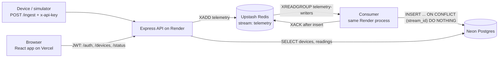

<!-- README.md -> ye f-step P6.4-f1 pe daalni hai (P6.4-f2: Screenshots + How to run tests) -->
# IoT Fleet Monitor

Devices send telemetry over HTTP. The API accepts it fast, queues it in a Redis stream,
and a consumer writes it to Postgres. A React dashboard shows each device's status and a
live chart. Built solo, deployed on free tiers.

- **Live app:** https://iot-fleet-monitor.vercel.app
- **API health:** https://iot-fleet-monitor-api.onrender.com/status
- **Note:** the API is on Render's free plan and sleeps after 15 minutes without traffic.
  The first request wakes it (see [Cold start](#cold-start-measured-not-guessed)).

## Architecture

1. A device sends `POST /ingest` with its API key. The API checks the key, validates the body
   (zod), adds the reading to the Redis stream and replies **202 Accepted**. 202, not 201:
   nothing is in Postgres yet.
2. The consumer reads the stream as part of a consumer group, inserts the batch into
   Postgres, and only then acknowledges (`XACK`) it.
3. The dashboard reads devices and readings from Postgres through the API and refreshes the
   device page every 5 seconds.

## Tech stack

| Part | Choice |
|---|---|
| API | Node 24, Express 5, zod, argon2, jsonwebtoken, node-redis, pg |
| Queue | Redis Streams + consumer group (Upstash in prod, Memurai locally) |
| Database | PostgreSQL (Neon in prod, Postgres 15 locally) |
| Web | React 19, Vite 8, React Router, TanStack Query, Recharts, Tailwind 4 |
| Hosting | Render (API), Vercel (web), all free tiers |
| Tests | `node:test` (built in) for web, Postman / newman collections for the deployed stack |

## Design decisions (and why)

**At-least-once delivery, made safe by a UNIQUE key.** Redis can deliver the same stream
entry twice (for example after a crash before `XACK`). `readings.stream_id` is `UNIQUE`, and
the insert uses `ON CONFLICT (stream_id) DO NOTHING`, so a redelivery is a no-op.
*Limit:* this only protects against Redis redelivery. If a device times out and retries, the
first request may already have arrived, and the retry gets a **new** stream id. That creates a
duplicate. A timeout does not mean "not delivered". Fix planned: an idempotency key on `/ingest`.

**Online/offline is computed, not stored.** A stored `status` column went stale. Now
`GET /devices` derives it on every request: online if `last_seen` is within 2 minutes.

**`/status` as well as `/health`.** The EasyPrivacy filter list blocks
`||onrender.com/health`, so Brave Shields and uBlock blocked the dashboard's health check.
The web app calls `/status` (same handler). `/health` stays for Render's health check.
Filter lists change, so this is a workaround, not a guarantee.

**The header says "ok" only for our JSON.** Vercel rewrites every unknown path to
`index.html` with status **200**. So "HTTP 200" alone can be a lie. `getHealth()` reports
"API ok" only when the reply is JSON with `status: "ok"`, and it does not crash on broken JSON.
Five unit tests cover this (`web/tests/getHealth.test.js`).

**The build fails without a valid `VITE_API_URL`.** Vite bakes this value into the JavaScript
at build time. Missing, it would silently become `undefined`, so `vite.config.js` stops the build.

## Security notes

- **XSS:** React escapes text by default, and the code has no `dangerouslySetInnerHTML`.
  Device names (user input) are rendered as text.
- **Known trade-off:** the JWT is kept in `localStorage`, so any XSS on the site could read it.
  Mitigations today: tokens expire after 2 hours, and the app re-checks the token with `/me`
  on load. Not done yet: a Content-Security-Policy header, or httpOnly cookies.
- Passwords are hashed with argon2id. Device API keys are random 256-bit values; only their
  SHA-256 hash is stored.
- Private API replies send `Cache-Control: no-store`. CORS allows only the Vercel origin.
- Secrets live in git-ignored `.env*.local` files and in the Render/Vercel dashboards.

## Cold start (measured, not guessed)

Render's docs say a sleeping free service can take **up to about a minute** to wake up.
I measured it **once** (24 Sept 2026) in the browser DevTools (Brave): `/status` took **22.9 s** cold
(almost all of it "waiting for server response", which includes Neon waking up) and
**0.48 s** warm. One sample only, so treat it as an example, not a constant.

**Why no uptime pinger:** keeping Render awake would keep the consumer polling Redis all
month. The consumer blocks for 5 s per read, so it makes about 12 Redis calls per minute while
awake: 12 x 60 x 24 x 30 = 518,400 calls a month. Upstash's free tier is 500,000 commands
a month. A pinger alone would use up the budget.

## Run it locally

Needs Node 24, PostgreSQL and a Redis-compatible server on `127.0.0.1:6379`.

1. Create a database and run `api/db/schema.sql` on it.
2. `cd api`, copy `.env.example` to `.env`, fill in your values, then `npm ci` and `npm run dev`
   (API on port 4000). Start the consumer with `npm run consumer`, or set
   `RUN_CONSUMER_IN_API=true`.
3. `cd web`, then `npm ci` and `npm run dev` (web on port 5173, reads `web/.env.development`).
4. The web app has login only. Create a user first with `POST /auth/register`
   (JSON body `email`, `password`), for example from Postman. Then log in and add a device.
   `npm run provision` and `npm run simulate` (in `api/`) create devices and send readings.

<!-- P6.4-f2: "How to run tests" section - ASH khud likhega (hint-only) -->

## What's next

- Anomaly detection: a scikit-learn model exported to ONNX and run inside the Node consumer
  (in progress).
- Idempotency key on `/ingest`, a Content-Security-Policy header, retry with backoff in the consumer.
