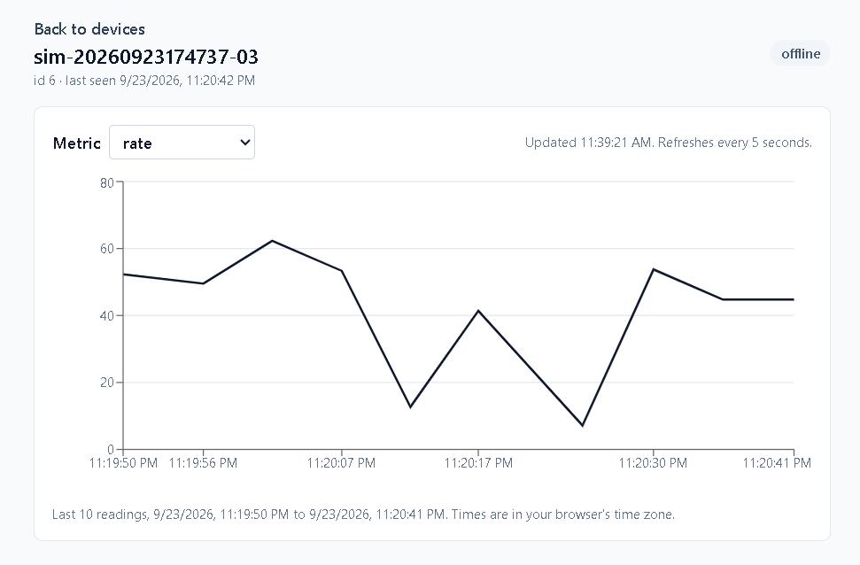
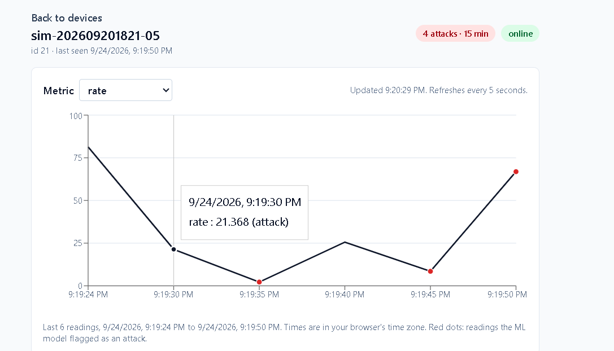
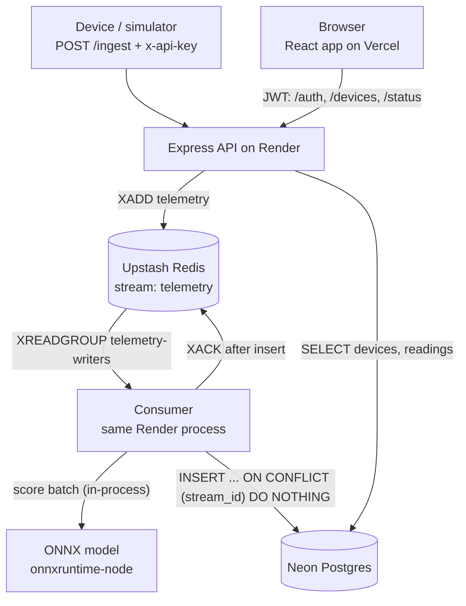

<!-- README.md -> ye f-step P5-f5 pe daalni hai (P6.4: diagram + screenshots + cold start; P5-f5: ML section) -->
# IoT Fleet Monitor

Devices send telemetry over HTTP. The API accepts it fast, queues it in a Redis stream,
and a consumer scores every reading with an intrusion-detection model (Random Forest,
exported to ONNX) and writes it to Postgres. A React dashboard shows each device's status,
a live chart, and the readings the model flagged as attacks. Built solo, deployed on free tiers.

- **Live app:** https://iot-fleet-monitor.vercel.app
- **API health:** https://iot-fleet-monitor-api.onrender.com/status
- **Note:** the API is on Render's free plan and sleeps after 15 minutes without traffic.
  The first request wakes it (see [Cold start](#cold-start-measured-not-guessed)).

## Screenshots

Device page: status badge and the live chart (refreshes every 5 seconds).



Attack alerts: the red badge counts readings the model flagged in the last 15 minutes, and
red dots on the chart mark them (local run with the simulator in `--anomaly` mode).



Cold start: the API was asleep, so the `/status` request had to wait (see its Time column)
before the header could say "API ok, database ok".


## Architecture



1. A device sends `POST /ingest` with its API key. The API checks the key, validates the body
   (zod), adds the reading to the Redis stream and replies **202 Accepted**. 202, not 201:
   nothing is in Postgres yet.
2. The consumer reads the stream as part of a consumer group, scores the whole batch with
   the model in one call, inserts readings and scores together into Postgres, and only then
   acknowledges (`XACK`) the batch.
3. The dashboard reads devices, readings and attack counts from Postgres through the API and
   refreshes every 5 seconds.

## Tech stack

| Part | Choice |
|---|---|
| API | Node 24, Express 5, zod, argon2, jsonwebtoken, node-redis, pg |
| Queue | Redis Streams + consumer group (Upstash in prod, Memurai locally) |
| Database | PostgreSQL (Neon in prod, Postgres 15 locally) |
| Web | React 19, Vite 8, React Router, TanStack Query, Recharts, Tailwind 4 |
| ML | Python 3.14 (uv), pandas, scikit-learn (Random Forest), skl2onnx; onnxruntime-node in the API |
| Hosting | Render (API), Vercel (web), all free tiers |
| Tests | `node:test` (built in) for web, Postman / newman collections for the deployed stack |

## Design decisions (and why)

**At-least-once delivery, made safe by a UNIQUE key.** Redis can deliver the same stream
entry twice (for example after a crash before `XACK`). `readings.stream_id` is `UNIQUE`, and
the insert uses `ON CONFLICT (stream_id) DO NOTHING`, so a redelivery is a no-op.
*Limit:* this only protects against Redis redelivery. If a device times out and retries, the
first request may already have arrived, and the retry gets a **new** stream id. That creates a
duplicate. A timeout does not mean "not delivered". Fix planned: an idempotency key on `/ingest`.

**Online/offline is computed, not stored.** A stored `status` column went stale. Now
`GET /devices` derives it on every request: online if `last_seen` is within 2 minutes.

**`/status` as well as `/health`.** The EasyPrivacy filter list blocks
`||onrender.com/health`, so Brave Shields and uBlock blocked the dashboard's health check.
The web app calls `/status` (same handler). `/health` stays for Render's health check.
Filter lists change, so this is a workaround, not a guarantee.

**The header says "ok" only for our JSON.** Vercel rewrites every unknown path to
`index.html` with status **200**. So "HTTP 200" alone can be a lie. `getHealth()` reports
"API ok" only when the reply is JSON with `status: "ok"`, and it does not crash on broken JSON.
Five unit tests cover this (`web/tests/getHealth.test.js`).

**The build fails without a valid `VITE_API_URL`.** Vite bakes this value into the JavaScript
at build time. Missing, it would silently become `undefined`, so `vite.config.js` stops the build.

## ML: intrusion detection

**Data.** CICIoT2023 from the Canadian Institute for Cybersecurity, University of New Brunswick
(Neto et al., *Sensors* 23(13):5941, 2023, https://doi.org/10.3390/s23135941). The model is
**binary**: benign vs attack (all 33 attack types in one class). I sampled 4,000 rows
(2,000 benign, 2,000 attack) and split them 80/20, stratified: 3,200 to train, 800 held out.

**The leak I found first.** With one feature, `iat`, the model scored F1 **0.991**. That was too
good. The values showed why: benign `iat` is 0 or about 166.5 million, attacks sit near
83 million, and each attack type has its own narrow band (DoS-TCP 82.93-82.96M, Mirai
83.68-83.79M). The number records *which capture session* a row came from, not packet
timing, so the model was learning the recording setup. I removed `iat`
(`ml/leak_check.py` shows the evidence). Worth noting: `iat` was **not** in the top 3 of the
feature importances, so low importance does not prove a feature is innocent. Correlated
features share importance. The test is to train with the feature alone and without it.

**Model and results.** Random Forest, 100 trees, 9 features (`ml/model.json` has the list and
order). On the 800 held-out rows (400 benign, 400 attack):

| | Predicted attack | Predicted benign |
|---|---|---|
| **Actual attack** | 387 (TP) | 13 (FN) |
| **Actual benign** | 2 (FP) | 398 (TN) |

Precision 0.995, recall 0.968, F1 **0.981**, false-positive rate 0.005.

**Why that precision will not hold in a real fleet.** The test set is 50% attacks. A fleet is
mostly benign. At the simulator's 3% attack rate, the same recall and false-positive rate give
precision of about **0.86**. And that FPR comes from only 2 mistakes in 400 benign rows, so
its 95% range (Clopper-Pearson) puts precision anywhere from **0.63 to 0.98**. More benign test
data is needed before trusting the number.

`class_weight="balanced"` is set, but on 50/50 data both weights come out as 1.00, so it does
not fix any imbalance here.

**Serving: ONNX inside the Node API.** `ml/train.py` exports the model to ONNX, and the
consumer runs it with `onnxruntime-node` in the same process. On all 800 test rows the Node
output matches scikit-learn: max probability difference 1.1e-7, zero label mismatches
(`npm run parity`), about 6 microseconds per row. On Render's free instance the model loads in
under a second at startup and the process uses about 127 MB of the 512 MB limit.
Rejected: a separate Python service (a second free service to host and wake up, plus a network
hop per batch).

**Failure behaviour.** If the model cannot load, the API still starts, `/status` reports
`"model": "unavailable"`, and readings are stored with a `NULL` score. A missing or
non-numeric feature also gives `NULL`, never a guess with 0. The dashboard shows a red dot only
for a real `is_attack = true`.

**Alerts.** `GET /devices` returns `recent_attacks`: flagged readings in the last 15 minutes,
counted by `received_at` (the API's clock, not the device's). There is no separate alerts
table, because an alert has no state of its own yet (no acknowledge or resolve).

**Caveat about the live demo.** The simulator replays rows from the same 4,000-row sample,
and 80% of those rows were training data. So a red dot in the demo shows that the pipeline
works end to end. It is **not** evidence of accuracy. The accuracy evidence is the held-out
table above.

## Security notes

- **XSS:** React escapes text by default, and the code has no `dangerouslySetInnerHTML`.
  Device names (user input) are rendered as text.
- **Known trade-off:** the JWT is kept in `localStorage`, so any XSS on the site could read it.
  Mitigations today: tokens expire after 2 hours, and the app re-checks the token with `/me`
  on load. Not done yet: a Content-Security-Policy header, or httpOnly cookies.
- Passwords are hashed with argon2id. Device API keys are random 256-bit values; only their
  SHA-256 hash is stored.
- Private API replies send `Cache-Control: no-store`. CORS allows only the Vercel origin.
- Secrets live in git-ignored `.env*.local` files and in the Render/Vercel dashboards.

## Cold start (measured, not guessed)

Render's docs say a sleeping free service can take **up to about a minute** to wake up.
I measured it **twice** on 24 Sept 2026 in the browser DevTools (Brave): `/status` took
**22.9 s** and **34.3 s** cold, and **0.48 s** warm. In the first run the Timing tab showed
almost all of it as "waiting for server response", which includes Neon waking up. The second
run is in the screenshot above. Two samples only, so treat them as examples, not a constant.

**Why no uptime pinger:** keeping Render awake would keep the consumer polling Redis all
month. The consumer blocks for 5 s per read, so it makes about 12 Redis calls per minute while
awake: 12 x 60 x 24 x 30 = 518,400 calls a month. Upstash's free tier is 500,000 commands
a month. A pinger alone would use up the budget.

## Run it locally

Needs Node 24, PostgreSQL and a Redis-compatible server on `127.0.0.1:6379`.

1. Create a database and run `api/db/schema.sql` on it.
2. `cd api`, copy `.env.example` to `.env`, fill in your values, then `npm ci` and `npm run dev`
   (API on port 4000). Start the consumer with `npm run consumer`, or set
   `RUN_CONSUMER_IN_API=true`.
3. `cd web`, then `npm ci` and `npm run dev` (web on port 5173, reads `web/.env.development`).
4. The web app has login only. Create a user first with `POST /auth/register`
   (JSON body `email`, `password`), for example from Postman. Then log in and add a device.
   `npm run provision` and `npm run simulate` (in `api/`) create devices and send readings.

## How to run tests

Web unit tests use Node's built-in test runner (`node:test`), so there is no extra test
package. Five cases check `getHealth()` (the header text) against a fake local server, so no
network and no running API are needed: the real JSON "ok" reply, an HTML page with status 200,
JSON without `status: "ok"`, broken JSON, and a 503. Two more check that only
`is_attack === true` becomes a red dot on the chart.

From the repo root, after `npm ci` in `web/`:

```bash
cd web
npm test
```

Expected: `pass 7` and `fail 0`.

The model has two checks of its own. Both need the sample file `api/scripts/samples.local.json`,
which `npm run extract` (in `api/`) builds from the CICIoT2023 CSVs in `data/`. Neither is in the
repo. `cd ml && uv run python train.py` retrains, exports and ends with `SELF-CHECK PASS`; it also
writes the test rows that `cd api && npm run parity` then uses to compare the Node output with
scikit-learn.

The deployed stack (API on Render, web on Vercel) is checked with Postman collections that
assert on body content, not only status codes: the JSON health reply, the CORS header and the
current JavaScript bundle name. These collections are kept outside the repo.

## What's next

- Which attack types make up the 13 missed attacks, and a separate demo sample that shares
  no rows with the training data.
- Idempotency key on `/ingest`, a Content-Security-Policy header, retry with backoff in the consumer.
