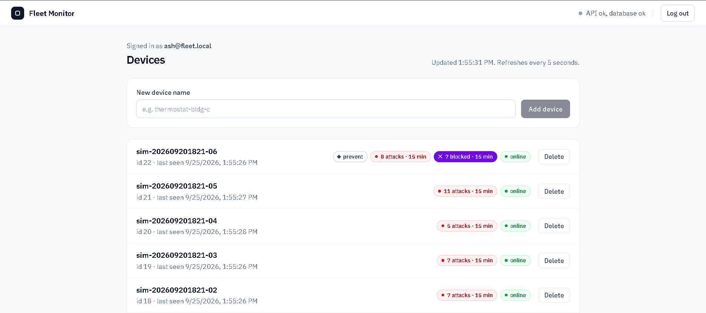
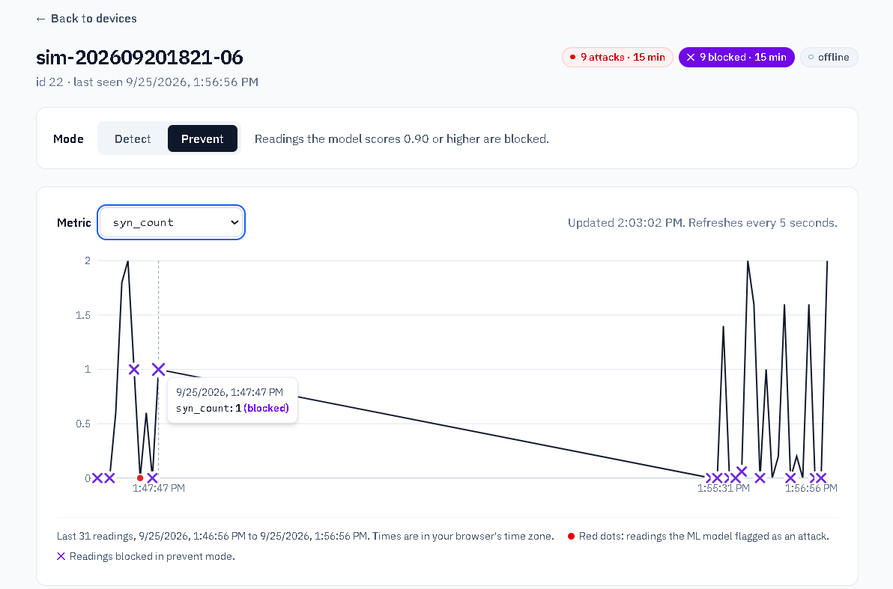
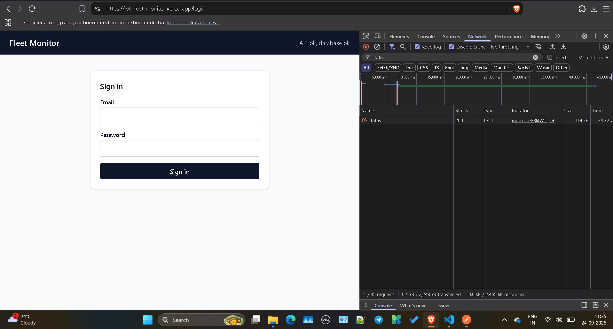
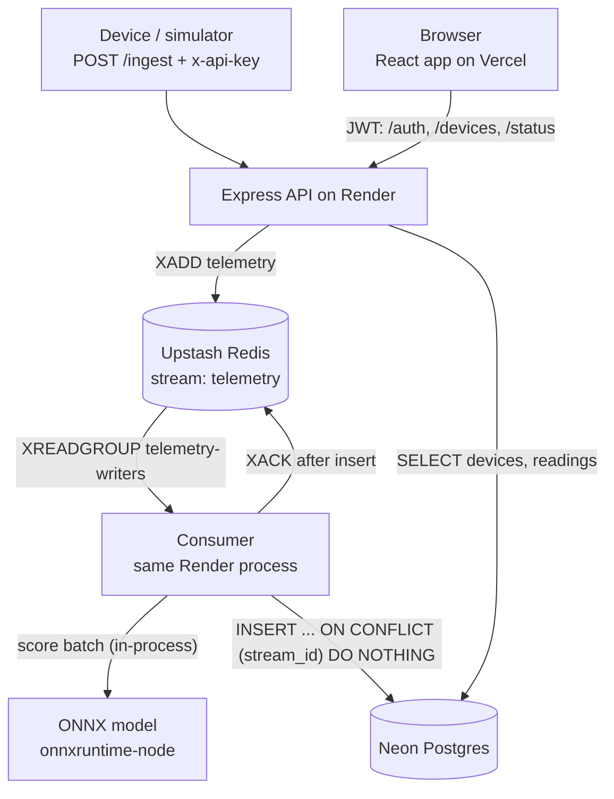

<!-- README.md -> ye f-step P9-d pe daalni hai (P6.4: diagram + screenshots + cold start; P5-f5: ML section; P7-f5: IPS mode; P8-d2: redesign screenshots + 13 tests; P9-d: ML section naye data/model/thresholds ke saath) -->
# IoT Fleet Monitor

Devices send telemetry over HTTP. The API accepts it fast, queues it in a Redis stream,
and a consumer scores every reading with an intrusion-detection model (Random Forest,
exported to ONNX) and writes it to Postgres. A React dashboard shows each device's status,
a live chart, and the readings the model flagged as attacks. A device can also run in
**prevent** mode (IPS): the API scores the reading before it replies and tells the gateway to
block it. Built solo, deployed on free tiers.

- **Live app:** https://iot-fleet-monitor.vercel.app
- **API health:** https://iot-fleet-monitor-api.onrender.com/status
- **Note:** the API is on Render's free plan and sleeps after 15 minutes without traffic.
  The first request wakes it (see [Cold start](#cold-start-measured-not-guessed)).

## Screenshots

The screens were redesigned in Claude Design and then built in React 19 + Tailwind 4.
Colour carries meaning only: **red** = the model flagged an attack, **violet** = blocked in
prevent mode, **green** = online, **amber** = something needs your attention (an error, the
one-time API key). Both screenshots are from a local run with the simulator in `--anomaly` mode.

Devices list: each chip counts the last 15 minutes. Device 22 runs in prevent mode, so it has
a violet "blocked" chip next to its red "attacks" chip; the others run in detect mode and only
raise alerts.



Device page in prevent mode (device 22, metric `syn_count`). Two simulator runs about 8 minutes
apart; the chart keeps the real time gap between them. Each violet ✕ is a reading the API told
the gateway to block (score 0.90 or higher). The one red dot is a `MITM-ArpSpoofing` attack
the model scored 0.68: it raised an alert but was not blocked, because 0.5 to 0.9 is alert-only.
Across both runs this device got 15 attacks, 14 were blocked, and 0 of 20 benign readings were
blocked. The tooltip is on a blocked reading. Both screenshots were taken with the first model and its
thresholds (alert 0.5, block 0.9). The current model alerts at 0.872 and blocks at 0.931
(see [ML](#ml-intrusion-detection)).



Cold start: the API was asleep, so the `/status` request had to wait (see its Time column)
before the header could say "API ok, database ok". This screenshot is from before the redesign.



## Architecture



1. A device sends `POST /ingest` with its API key. The API checks the key, validates the body
   (zod), adds the reading to the Redis stream and replies **202 Accepted**. 202, not 201:
   nothing is in Postgres yet. In prevent mode the API also scores the reading first and puts
   its decision in the reply (see [IPS mode](#ips-mode-detect-or-prevent)).
2. The consumer reads the stream as part of a consumer group, scores the whole batch with
   the model in one call, inserts readings and scores together into Postgres, and only then
   acknowledges (`XACK`) the batch.
3. The dashboard reads devices, readings and attack counts from Postgres through the API and
   refreshes every 5 seconds.

## Tech stack

| Part | Choice |
|---|---|
| API | Node 24, Express 5, zod, argon2, jsonwebtoken, node-redis, pg |
| Queue | Redis Streams + consumer group (Upstash in prod, Memurai locally) |
| Database | PostgreSQL (Neon in prod, Postgres 15 locally) |
| Web | React 19, Vite 8, React Router, TanStack Query, Recharts, Tailwind 4 |
| ML | Python 3.14 (uv), pandas, scikit-learn (Random Forest), skl2onnx; onnxruntime-node in the API |
| Hosting | Render (API), Vercel (web), all free tiers |
| Tests | `node:test` (built in) for web, Postman / newman collections for the deployed stack |

## Design decisions (and why)

**At-least-once delivery, made safe by a UNIQUE key.** Redis can deliver the same stream
entry twice (for example after a crash before `XACK`). `readings.stream_id` is `UNIQUE`, and
the insert uses `ON CONFLICT (stream_id) DO NOTHING`, so a redelivery is a no-op.
*Limit:* this only protects against Redis redelivery. If a device times out and retries, the
first request may already have arrived, and the retry gets a **new** stream id. That creates a
duplicate. A timeout does not mean "not delivered". Fix planned: an idempotency key on `/ingest`.

**Online/offline is computed, not stored.** A stored `status` column went stale. Now
`GET /devices` derives it on every request: online if `last_seen` is within 2 minutes.

**`/status` as well as `/health`.** The EasyPrivacy filter list blocks
`||onrender.com/health`, so Brave Shields and uBlock blocked the dashboard's health check.
The web app calls `/status` (same handler). `/health` stays for Render's health check.
Filter lists change, so this is a workaround, not a guarantee.

**The header says "ok" only for our JSON.** Vercel rewrites every unknown path to
`index.html` with status **200**. So "HTTP 200" alone can be a lie. `getHealth()` reports
"API ok" only when the reply is JSON with `status: "ok"`, and it does not crash on broken JSON.
Five unit tests cover this (`web/tests/getHealth.test.js`).

**The build fails without a valid `VITE_API_URL`.** Vite bakes this value into the JavaScript
at build time. Missing, it would silently become `undefined`, so `vite.config.js` stops the build.

## ML: intrusion detection

**Data.** CICIoT2023 from the Canadian Institute for Cybersecurity, University of New Brunswick
(Neto et al., *Sensors* 23(13):5941, 2023, https://doi.org/10.3390/s23135941). The CSV release
is 169 files, 13.8 GB, 46,686,579 rows: benign traffic plus 33 attack types. The model is
**binary**: benign vs attack. Benign is only 2.4% of the dataset, the opposite of a real network.

**Sampling (`ml/pool.py`).** One pass over all 169 files with 4 worker processes, about 96 s on
my laptop. Each worker reads one file at a time and keeps only 11 of its 47 columns. Every
row gets a seeded random tag, and each label keeps the rows with the smallest tags (bottom-k
sampling). Per-file results merge exactly, so the sample does not depend on the number of
workers or the order in which files finish. Caps: 6,000 rows per attack type and 200,000
benign, 383,091 rows in total. Rare types are kept whole (`Uploading_Attack` has 1,252 rows in
the entire dataset). Each label is then split four ways, and no row is in two splits:

| Split | Share | Used for |
|---|---|---|
| train | 65% | fitting the model |
| validation | 15% | choosing the model and both thresholds |
| test | 15% | the final numbers, run once |
| demo | 5% | the simulator |

Only 0.7% of test rows have an exact twin (same 9 feature values) in train. Floods repeat.

**The leak I found first.** With one feature, `iat`, the first model scored F1 **0.991**. That
was too good. The values showed why: benign `iat` is 0 or about 166.5 million, attacks sit near
83 million, and each attack type has its own narrow band (DoS-TCP 82.93-82.96M, Mirai
83.68-83.79M). The number records *which capture session* a row came from, not packet
timing, so the model was learning the recording setup. I removed `iat`
(`ml/leak_check.py` shows the evidence). Worth noting: `iat` was **not** in the top 3 of the
feature importances, so low importance does not prove a feature is innocent. Correlated
features share importance. The test is to train with the feature alone and without it.

**Why the first headline number was misleading.** The first model (4,000 sampled rows) reported
recall 0.968 on 800 test rows. That test set followed the dataset's mix, which is mostly DDoS
floods, and floods are easy. On the new validation split, where every attack type counts the
same, the same model caught 0.60 of attacks, and 10 of the 33 types stayed under 20%
(DDoS-SlowLoris 0.01, VulnerabilityScan 0.02). So this README reports two recalls:

- **macro**: the average of the 33 per-type recalls, so every attack type counts the same
- **natural**: per-type recall weighted by how common each type is in the dataset

**Learning curve (`ml/curve.py`, validation set, threshold 0.5).** Training sizes of 2k, 20k and
100k rows per class (benign N + attack N, with attack rows spread evenly over the 33 types),
with trees either unlimited or capped at 1,000 leaves:

| Training rows per class | Trees | Recall | False-positive rate | ONNX file |
|---|---|---|---|---|
| 2k | unlimited | 0.900 | 0.086 | 2.4 MB |
| 20k | unlimited | 0.924 | 0.075 | 19.0 MB |
| 100k | unlimited | 0.931 | 0.058 | 83.5 MB |
| 2k | max 1,000 leaves | 0.900 | 0.088 | 2.4 MB |
| 20k | max 1,000 leaves | 0.922 | 0.081 | 7.8 MB |
| 100k | max 1,000 leaves | 0.926 | 0.069 | 7.8 MB |

Unlimited trees grow with the data. The API runs on a 512 MB free instance, so the model file
budget is 10 MB, and capped trees stay at 7.8 MB.

**My mistake in that table.** At 0.5 the new models flag 6-9% of benign rows; the first model
flagged 0.4%. Recall at different false-positive rates is not a fair comparison, because a lower
threshold buys recall for any model. At the simulator's 3% attack rate, a 0.5 threshold would
have given precision of about 0.3: seven of ten alerts false.

**Same false-positive rate (`ml/compare.py`, validation set).** Each model gets its own
threshold, set so that at most 0.5% (or 0.1%) of benign validation rows are flagged:

| Model | AUC | Macro recall, FPR ≤ 0.5% | Macro recall, FPR ≤ 0.1% | ONNX file |
|---|---|---|---|---|
| first model (3,200 training rows) | 0.930 | 0.575 | 0.513 | 0.4 MB |
| 20k, capped | 0.977 | 0.701 | 0.591 | 7.8 MB |
| **100k, capped (chosen)** | **0.980** | **0.725** | **0.639** | **7.8 MB** |
| 100k, unlimited | 0.984 | 0.756 | 0.669 | 83.5 MB |

More data still helps (20k to 100k adds 2.4 points), and the 10 MB cap costs about 3 points
against the unlimited model.

**Final model and test (`ml/train.py`; the test set was used once).** Random Forest, 100 trees,
at most 1,000 leaves per tree, 9 features (`ml/model.json` has the list and order), 200,000
training rows. Both thresholds were chosen on validation: **alert** at score ≥ 0.872 (benign
FPR ≤ 0.5%) and **block** at ≥ 0.931 (≤ 0.1%). On the 57,464 test rows (27,464 attack, 30,000
benign), AUC 0.980:

| | Threshold | False positives | Macro recall | Natural recall | Precision at 3% attacks |
|---|---|---|---|---|---|
| **Alert** | 0.872 | 121 of 30,000 (0.40%) | **0.721** | 0.983 | 0.85 |
| **Block** | 0.931 | 31 of 30,000 (0.10%) | **0.634** | 0.979 | 0.95 |
| First model, alert | 0.480 | 124 of 30,000 (0.41%) | 0.577 | 0.978 | 0.81 |

At the same false-positive rate, macro recall went from 0.577 to 0.721. The last column
assumes a fleet with 3% attacks (the simulator's default): precision =
r·R / (r·R + FPR·(1 − r)), with r = 0.03 and R = macro recall.

**Where it fails.** Flood and fragmentation attacks (the DDoS, DoS and Mirai floods) are caught
at 0.96 or more, except DoS-HTTP_Flood at 0.90. Slow and content-based attacks are not (alert
threshold, test set): DDoS-SlowLoris 0.36, DictionaryBruteForce 0.24, BrowserHijacking 0.28, Recon-OSScan 0.28, DNS_Spoofing 0.35,
XSS 0.40, SqlInjection 0.47, MITM-ArpSpoofing 0.48. The 9 features describe a flow's size,
rate, duration and TCP flags. At that level an XSS or SQL injection request looks like any
other small web request, because the attack is in the payload, which these features never see.
In the CICIoT2023 paper's own results, reconnaissance was also often confused with benign
traffic.

**Serving: ONNX inside the Node API.** `ml/train.py` exports the model to ONNX, and the API and
consumer run it with `onnxruntime-node` in the same process. On all 57,464 test rows the Node
output matches scikit-learn: max probability difference 6.1e-7, zero label mismatches
(`npm run parity`), about 3 microseconds per row on my laptop. On Render's free instance the
model loads in 2.3 s at startup, and the process grows from 89 MB to 210 MB of the 512 MB limit.
Both thresholds live in `ml/model.json`, next to the model, not in the code: a new model gives
new scores, so it brings its own thresholds. If they are missing, or alert is above block, the
API treats the model as unavailable. Rejected: a separate Python service (a second free service
to host and wake up, plus a network hop per batch).

**Failure behaviour.** If the model cannot load, the API still starts, `/status` reports
`"model": "unavailable"`, and readings are stored with a `NULL` score. A missing or
non-numeric feature also gives `NULL`, never a guess with 0. The dashboard shows a red dot only
for a real `is_attack = true`.

**Alerts.** `GET /devices` returns `recent_attacks`: flagged readings in the last 15 minutes,
counted by `received_at` (the API's clock, not the device's). There is no separate alerts
table, because an alert has no state of its own yet (no acknowledge or resolve).

**The live demo.** The simulator replays the demo split (`ml/demo.py` writes
`api/scripts/samples.local.json`): 10,000 benign and 9,154 attack rows that the model never saw
in training, validation or test. The first sample was different: 80% of its rows were training
data, so a red dot then only proved the pipeline worked.

## IPS mode: detect or prevent

Every device has a `mode`: `detect` (the default) or `prevent`. It is changed with
`PATCH /devices/:id` or the Detect | Prevent toggle on the device page.

- **Detect (IDS):** nothing changes. `/ingest` replies 202 at once and the consumer scores the
  reading later. The model only raises alerts.
- **Prevent (IPS):** `/ingest` scores the reading inside the request, before it replies, and the
  202 body carries `action: "block"` or `"allow"`, a `reason` and the `attack_proba`.

**Who decides and who blocks.** The API is the decision point (PDP): it only says allow or
block. Stopping the traffic is the job of the gateway in front of the device, the enforcement
point (PEP). Here the simulator plays the gateway: it prints `BLOCKED` and counts the reading as
not forwarded. The API still stores a blocked reading, with `readings.action = 'blocked'`, as an
audit record of what was stopped and why. The reply is 202 even for a block. The request was
valid and was recorded, and the decision is in the body, so a client does not mistake a block
for a failed request.

**Two thresholds, both chosen on the validation split.** Alert at 0.872 (at most 0.5% of benign
validation rows flagged) and block at 0.931 (at most 0.1%). A wrong alert is a stray red dot.
A wrong block drops a real device's data, so blocking gets the stricter limit. Between the two,
the model raises an alert but the gateway lets the reading through. On the test set, the block
threshold stopped 31 of 30,000 benign rows (0.10%) and 63% of attacks averaged over the 33
types (98% on the dataset's natural mix). Until then the block threshold was 0.9, picked on the
same 800 test rows it was measured on, which made its numbers optimistic.

**Fail open or fail closed, depending on whose fault it is.**
- The model did not load (our fault): **allow**, with `reason: "model_unavailable"`, logged
  once. Telemetry keeps flowing. The cost: during a model outage, prevent mode protects nothing.
- The model is loaded but the reading is missing a feature (the device's input): **block**,
  with `reason: "missing_features"`. Allowing it would let an attacker skip scoring by dropping
  one field.

**What it cannot stop.**
- Slow and content-based attacks (see [Where it fails](#ml-intrusion-detection)). Even at the alert
  threshold only about a quarter to a half of reconnaissance, spoofing, brute-force and web
  attacks are caught, and the stricter block threshold stops fewer. These 9 flow features cannot
  see a payload.
- No IP blocklist. CICIoT2023's features do not include the attacker's IP, so the system blocks
  a reading (a flow), not a source.
- Each reading is scored on its own. There is no memory of a device's recent behaviour.

**Latency.** Prevent replies carry a `Server-Timing: predict;dur=...` header, so the model's
share of each request is visible in DevTools or Postman. In a Linux test environment (not on
Render, first model) scoring one row took about 0.15 ms (p50), and `/ingest` took about 2.5 ms (p50) in
both modes. From my laptop a prevent request took about 220 ms, but requests that never reach
the model (`missing_features`) took just as long, so that time is not the model.

**A production bug this found.** Blocked readings were missing from the production database,
while the API kept replying `block`. The consumer's log said `attack_proba not in 0..1`. The
log did not print the value, but the evidence points to a score just above 1: in float32 the
next number after 1 is 1.0000001, which fails that check yet shows as `p=1.00` in the
simulator (it rounds to 2 decimals). It happened on Render (Linux) and not in my local runs on
Windows. Fix: clamp the score to 0..1 where the model runs, keep the strict check in the
consumer, and print the bad value in the log. After the fix, blocked rows reached the
production database. Lesson: check a deploy in the database, not in the API reply.

## Security notes

- **XSS:** React escapes text by default, and the code has no `dangerouslySetInnerHTML`.
  Device names (user input) are rendered as text.
- **Known trade-off:** the JWT is kept in `localStorage`, so any XSS on the site could read it.
  Mitigations today: tokens expire after 2 hours, and the app re-checks the token with `/me`
  on load. Not done yet: a Content-Security-Policy header, or httpOnly cookies.
- Passwords are hashed with argon2id. Device API keys are random 256-bit values; only their
  SHA-256 hash is stored.
- Private API replies send `Cache-Control: no-store`. CORS allows only the Vercel origin.
- Secrets live in git-ignored `.env*.local` files and in the Render/Vercel dashboards.

## Cold start (measured, not guessed)

Render's docs say a sleeping free service can take **up to about a minute** to wake up.
I measured it **twice** on 24 Sept 2026 in the browser DevTools (Brave): `/status` took
**22.9 s** and **34.3 s** cold, and **0.48 s** warm. In the first run the Timing tab showed
almost all of it as "waiting for server response", which includes Neon waking up. The second
run is in the screenshot above. Two samples only, so treat them as examples, not a constant.

**Why no uptime pinger:** keeping Render awake would keep the consumer polling Redis all
month. The consumer blocks for 5 s per read, so it makes about 12 Redis calls per minute while
awake: 12 x 60 x 24 x 30 = 518,400 calls a month. Upstash's free tier is 500,000 commands
a month. A pinger alone would use up the budget.

## Run it locally

Needs Node 24, PostgreSQL and a Redis-compatible server on `127.0.0.1:6379`.

1. Create a database and run `api/db/schema.sql` on it.
2. `cd api`, copy `.env.example` to `.env`, fill in your values, then `npm ci` and `npm run dev`
   (API on port 4000). Start the consumer with `npm run consumer`, or set
   `RUN_CONSUMER_IN_API=true`.
3. `cd web`, then `npm ci` and `npm run dev` (web on port 5173, reads `web/.env.development`).
4. The web app has login only. Create a user first with `POST /auth/register`
   (JSON body `email`, `password`), for example from Postman. Then log in and add a device.
   `npm run provision` and `npm run simulate` (in `api/`) create devices and send readings.
   The simulator reads `api/scripts/samples.local.json`, which `ml/demo.py` writes.

## How to run tests

Web unit tests use Node's built-in test runner (`node:test`), so there is no extra test
package. Five cases check `getHealth()` (the header text) against a fake local server, so no
network and no running API are needed: the real JSON "ok" reply, an HTML page with status 200,
JSON without `status: "ok"`, broken JSON, and a 503. Two more check that only
`is_attack === true` becomes a red dot on the chart. One checks that only
`action === 'blocked'` becomes a ✕, and two check `setDeviceMode()`: it sends a `PATCH` with the
token and `{ mode }`, and a 404 or 401 throws an `ApiError` carrying the status. Three check the
header's colour (`healthTone()`): only the exact "API ok, database ok" text is grey, the first
"Checking API..." has a hollow dot, and anything else (database down, HTTP error, unreachable)
is amber.

From the repo root, after `npm ci` in `web/`:

```bash
cd web
npm test
```

Expected: `pass 13` and `fail 0`.

The model pipeline needs the CICIoT2023 CSVs in `data/` (not in the repo). From `ml/`, in order:
`uv run python pool.py` (sample and the four splits), `curve.py` (learning curve), `compare.py`
(same-FPR comparison and thresholds), `train.py` (final model, test set once, ONNX export) and
`demo.py` (the simulator's sample). Each ends with `SELF-CHECK PASS`. Then `cd api && npm run parity`
compares the Node output with scikit-learn on every test row.

The deployed stack (API on Render, web on Vercel) is checked with Postman collections that
assert on body content, not only status codes: the JSON health reply, the CORS header and the
current JavaScript bundle name. These collections are kept outside the repo.

## What's next

- Payload-level features for the web attacks (XSS, SQL injection), which flow features cannot see.
- Idempotency key on `/ingest`, a Content-Security-Policy header, retry with backoff in the consumer.
